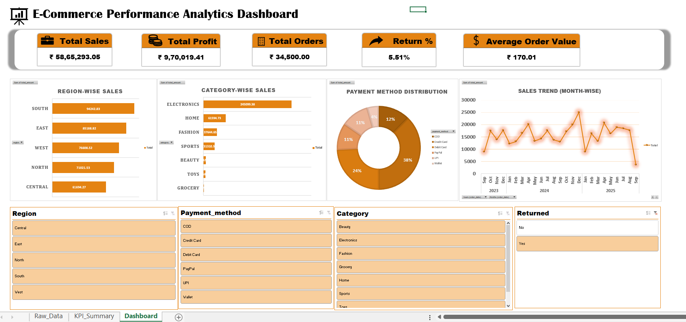

# E-commerce Sales Dashboard (Excel)

This project is an interactive Excel dashboard created to analyze e-commerce sales performance using KPIs, charts, slicers, and filters.
## Overall Dashboard Walkthrough (Video)

🎥 Watch Demo: https://drive.google.com/file/d/1uckv-xPmdqjS6b03VuPZC173Uiy_2fY8/view?usp=drive_link

## Dashboard Screenshots

### Overall Dashboard View

### Keep Performance Index Analysis

### Rawdata

## Features
- Sales and revenue analysis  
- Category and region-wise performance  
- Interactive slicers and timelines  
- Clean visual insights for decision making  

## Tools Used
- Microsoft Excel  
- Pivot Tables  
- Charts & Slicers  

## Objective
To transform raw e-commerce data into meaningful business insights and support data-driven decisions.
